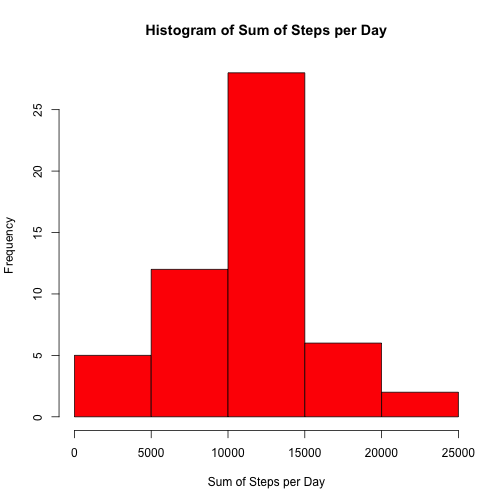
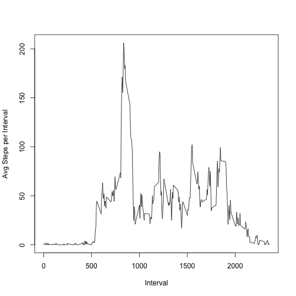
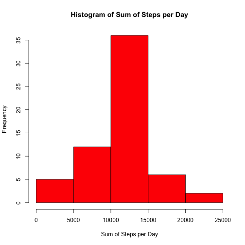
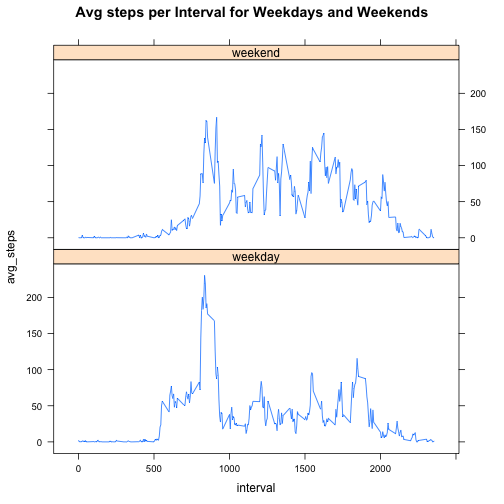

Load data
---

```r
data<-read.csv("activity.csv",sep=",",header=TRUE)
```
---
Make histogram of the total number of steps taken each day ignoring missing values

```r
library(plyr)
x<-ddply(na.omit(data),.(date),summarize,sum_of_steps=sum(steps))
hist(x$sum_of_steps,col="red",xlab="Sum of Steps per Day",main="Histogram of Sum of Steps per Day")
```

 
---
Calculate the mean and median total number of steps taken per day

```r
mean(x$sum_of_steps)
```

```
## [1] 10766.19
```

```r
median(x$sum_of_steps)
```

```
## [1] 10765
```
---
Plot Avg daily activity pattern

```r
y<-ddply(na.omit(data),.(interval),summarize,avg_steps=mean(steps))
plot(y$interval,y$avg_steps,type="l",xlab="Interval",ylab="Avg Steps per Interval")
```

 
---
Show interval with max avg steps

```r
max<-lapply(y,max)
print(max)
```

```
## $interval
## [1] 2355
## 
## $avg_steps
## [1] 206.1698
```
---
Calculate number of missing values

```r
sum(is.na(data$steps))
```

```
## [1] 2304
```
---
Replace missing values with mean of each interval

```r
library(plyr)
impute.mean<-function(x) replace(x,is.na(x),mean(x,na.rm=TRUE))
data2<-ddply(data,~interval,transform,steps=impute.mean(steps))
```
---
Order data by date and then by interval

```r
data2[order(data2$date,data2$interval),]
```
---
Draw histogram of sum of steps per day with missing values replaced data

```r
xx<-ddply(data2,.(date),summarize,sum_of_steps=sum(steps))
hist(xx$sum_of_steps,col="red",xlab="Sum of Steps per Day",main="Histogram of Sum of Steps per Day")
```

 
---
Calculate the mean and median total number of steps taken per day

```r
mean(xx$sum_of_steps)
```

```
## [1] 10766.19
```

```r
median(xx$sum_of_steps)
```

```
## [1] 10766.19
```
---
Calculate difference of mean and median between data with ignored missing values and data with replaced missing values

```r
mean(xx$sum_of_steps)-mean(x$sum_of_steps)
```

```
## [1] 0
```

```r
median(xx$sum_of_steps)-median(x$sum_of_steps)
```

```
## [1] 1.188679
```
---
Looking at activity patterns between weekdays and weekends
Create factor for weekdays and weekend

```r
data2$Date<-as.POSIXct(data2$date,format="%Y-%m-%d")
data2$weekday<-weekdays(data2[,4])
data2$weekend<-ifelse(data2$weekday=="Saturday"|data2$weekday=="Sunday","weekend","weekday")
```
---
Create plots for weekday and weekend avg steps per interval

```r
yyy<-ddply(data2,.(interval,weekend),summarize,avg_steps=mean(steps))
library(lattice)
xyplot(avg_steps~interval|weekend,data=yyy,layout=c(1,2),type="l",main="Avg steps per Interval for Weekdays and Weekends")
```

 
---
End
